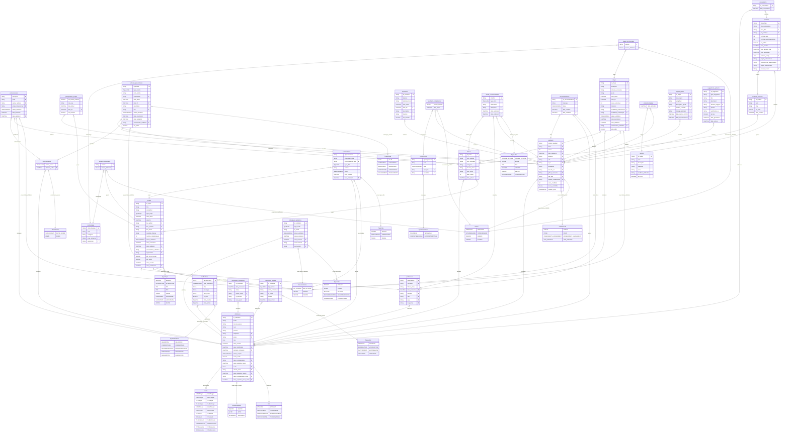

```mermaid
erDiagram

        StatusValidation {
            EN_ATTENTE EN_ATTENTE
VALIDE VALIDE
REJETE REJETE
        }
    


        Role {
            ETUDIANT ETUDIANT
PROFESSEUR PROFESSEUR
ADMINISTRATEUR ADMINISTRATEUR
PROFESSIONNEL PROFESSIONNEL
        }
    


        Niveau {
            DEBUTANT DEBUTANT
INTERMEDIAIRE INTERMEDIAIRE
AVANCE AVANCE
EXPERT EXPERT
        }
    


        StatusUtilisateur {
            INACTIF INACTIF
ACTIF ACTIF
SUSPENDU SUSPENDU
        }
    


        NiveauAcces {
            SUPER_ADMIN SUPER_ADMIN
ADMIN ADMIN
        }
    


        Ecole {
            ENSATanger ENSATanger
ENCGTanger ENCGTanger
FSTTanger FSTTanger
FSJESTanger FSJESTanger
ENSATetouan ENSATetouan
ENSTetouan ENSTetouan
FSTetouan FSTetouan
FLSHMartil FLSHMartil
FSJESTetouan FSJESTetouan
ENSAAlHoceima ENSAAlHoceima
FSTAlHoceima FSTAlHoceima
FPDAlHoceima FPDAlHoceima
        }
    


        TypeProjet {
            MODULE MODULE
INTEGRATION INTEGRATION
PFA PFA
PFE PFE
STAGE STAGE
PERSONNEL PERSONNEL
HACKATHON HACKATHON
AUTRE AUTRE
        }
    


        TypeCompetence {
            TECHNIQUE TECHNIQUE
COMPORTEMENTALE COMPORTEMENTALE
        }
    


        TypeEntite {
            PROJET PROJET
STAGE STAGE
ACTIVITE ACTIVITE
RECOMMANDATION RECOMMANDATION
COMMENTAIRE COMMENTAIRE
        }
    


        TypeCible {
            PROJET PROJET
COMPETENCE COMPETENCE
PROFIL PROFIL
        }
    


        TypeLettre {
            DOUBLE_DIPLOME DOUBLE_DIPLOME
STAGE STAGE
PFE PFE
MASTER MASTER
EMPLOI EMPLOI
INTERNATIONAL INTERNATIONAL
        }
    


        TypeNotification {
            VALIDATION VALIDATION
COMMENTAIRE COMMENTAIRE
RECOMMANDATION RECOMMANDATION
ATTESTATION ATTESTATION
SUGGESTION SUGGESTION
        }
    


        TypeAction {
            CREATION CREATION
MODIFICATION MODIFICATION
SUPPRESSION SUPPRESSION
VALIDATION VALIDATION
        }
    


        VisibiliteProfil {
            PUBLIC PUBLIC
PRIVE PRIVE
ENSEIGNANTS_UNIQUEMENT ENSEIGNANTS_UNIQUEMENT
LIEN_PARTAGE LIEN_PARTAGE
        }
    


        TypeActivite {
            CLUB CLUB
EVENEMENT EVENEMENT
HACKATHON HACKATHON
COMPETITION COMPETITION
ENGAGEMENT ENGAGEMENT
        }
    
  "utilisateurs" {
    String id_utilisateur "🗝️"
    String email 
    String mot_de_passe 
    String nom 
    String prenom 
    String telephone "❓"
    String photo "❓"
    Role role 
    DateTime date_creation 
    DateTime date_modification "❓"
    DateTime derniere_connexion "❓"
    StatusUtilisateur status_compte 
    Boolean email_verifie 
    String token_reinitialisation "❓"
    DateTime date_expiration_token "❓"
    Ecole ecole "❓"
    String refresh_token "❓"
    DateTime date_expiration_refresh "❓"
    String token_reinitialisation_email "❓"
    DateTime date_expiration_token_email "❓"
    }
  

  "administrateurs" {
    NiveauAcces niveau_acces 
    DateTime derniere_action "❓"
    }
  

  "etudiants" {
    String numero_etudiant "❓"
    String filiere "❓"
    Int annee "❓"
    DateTime date_naissance "❓"
    String adresse "❓"
    String ville "❓"
    String pays "❓"
    String biographie "❓"
    String linkedin_url "❓"
    String github_username "❓"
    String site_web "❓"
    String objectif_professionnel "❓"
    Int score_credibilite 
    Niveau niveau_credibilite 
    VisibiliteProfil visibilite_profil 
    }
  

  "professeurs" {
    String departement "❓"
    String specialite "❓"
    String filieres_interv 
    DateTime date_naissance "❓"
    String adresse "❓"
    String ville "❓"
    String pays "❓"
    String biographie "❓"
    }
  

  "professionnels" {
    String entreprise "❓"
    String poste "❓"
    String secteur_activite "❓"
    String email_professionnel "❓"
    StatusValidation status_validation 
    DateTime date_demande 
    DateTime date_validation "❓"
    }
  

  "projets" {
    String id_projet "🗝️"
    String titre 
    String description 
    TypeProjet type_projet 
    DateTime date_debut 
    DateTime date_fin "❓"
    String lien_github "❓"
    String lien_youtube "❓"
    String lien_demo "❓"
    String resultats_obtenus "❓"
    Int nombre_collaborateurs 
    StatusValidation status_validation 
    DateTime date_soumission 
    DateTime date_validation "❓"
    String commentaire_validation "❓"
    String appreciation "❓"
    Boolean est_mis_en_avant 
    Boolean est_public 
    DateTime date_creation 
    DateTime date_modification "❓"
    }
  

  "participations_projets" {
    Boolean est_visible_portfolio 
    String role_joue 
    DateTime date_debut 
    DateTime date_fin "❓"
    Boolean est_createur 
    }
  

  "stages" {
    String id_stage "🗝️"
    String entreprise 
    String adresse_entreprise "❓"
    String poste 
    DateTime date_debut 
    DateTime date_fin "❓"
    Int duree_semaines "❓"
    String missions 
    String encadrant_professionnel "❓"
    String encadrant_academique "❓"
    StatusValidation status_validation 
    DateTime date_soumission 
    DateTime date_validation "❓"
    String commentaire_validation "❓"
    Boolean est_public 
    }
  

  "activites_parascolaires" {
    String id_activite "🗝️"
    TypeActivite type_activite 
    String nom_activite 
    String organisation "❓"
    DateTime date_debut 
    DateTime date_fin "❓"
    String description "❓"
    String role "❓"
    StatusValidation status_validation 
    DateTime date_soumission 
    DateTime date_validation "❓"
    String commentaire_validation "❓"
    Boolean est_public 
    }
  

  "formations" {
    String id_formation "🗝️"
    String diplome 
    String etablissement 
    DateTime date_debut 
    DateTime date_fin "❓"
    String description "❓"
    String mention "❓"
    Boolean est_actuelle 
    }
  

  "competences" {
    String id_competence "🗝️"
    String nom 
    TypeCompetence type 
    String categorie "❓"
    String description "❓"
    }
  

  "etudiants_competences" {
    Niveau niveau_maitrise 
    DateTime date_ajout 
    }
  

  "technologies" {
    String id_technologie "🗝️"
    String nom 
    String categorie 
    String sous_categorie "❓"
    String description "❓"
    }
  

  "projets_technologies" {
    String version "❓"
    Niveau niveau_utilisation 
    }
  

  "stages_technologies" {
    String version "❓"
    Niveau niveau_utilisation 
    }
  

  "historiques_validations" {
    String id_validation "🗝️"
    TypeEntite type_entite 
    String id_entite 
    StatusValidation status_validation 
    DateTime date_soumission 
    DateTime date_decision "❓"
    String commentaires "❓"
    String appreciation "❓"
    }
  

  "fichiers" {
    String id_fichier "🗝️"
    String nom_original 
    String nom_stockage 
    String categorie 
    String chemin_minio 
    String type_mime 
    Int taille_octets 
    DateTime date_upload 
    }
  

  "lettres_recommandation" {
    String id_lettre "🗝️"
    TypeLettre type_lettre 
    String destinataire 
    String description "❓"
    DateTime date_redaction 
    DateTime date_validation "❓"
    }
  

  "commentaires" {
    String id_commentaire "🗝️"
    String id_etudiant_cible 
    String id_competence_cible "❓"
    TypeCible type_cible 
    String contenu 
    StatusValidation status 
    DateTime date_creation 
    DateTime date_validation "❓"
    }
  

  "recommandations" {
    String id_recommandation "🗝️"
    String message "❓"
    StatusValidation status 
    DateTime date_creation 
    DateTime date_validation "❓"
    }
  

  "portfolios" {
    String id_portfolio "🗝️"
    String titre_personnalise "❓"
    String sous_titre "❓"
    String url_publique "❓"
    Int nombre_vues 
    Int nombre_recommandations 
    Boolean est_publie 
    DateTime date_creation 
    DateTime date_derniere_maj "❓"
    DateTime date_publication "❓"
    Json sections_config "❓"
    String projets_selectionnes 
    String competences_selectionnees 
    String stages_selectionnes 
    String couleur_accent "❓"
    }
  

  "consultations" {
    String id_consultation "🗝️"
    DateTime date_consultation 
    }
  

  "modeles_portfolios" {
    String id_modele "🗝️"
    String nom 
    String slug 
    Boolean est_actif 
    DateTime date_creation 
    }
  

  "badges" {
    String id_badge "🗝️"
    String nom 
    String description 
    String categorie 
    String icone 
    String condition_attribution 
    Boolean est_actif 
    }
  

  "etudiants_badges" {
    DateTime date_attribution 
    }
  

  "depots_github" {
    String id_depot "🗝️"
    String nom_depot 
    String url_github 
    String description_github "❓"
    Int nombre_commits "❓"
    String langage_principal "❓"
    DateTime date_dernier_commit "❓"
    DateTime date_synchronisation "❓"
    }
  

  "suggestions_systeme" {
    String id_suggestion "🗝️"
    String type_suggestion 
    String titre 
    String description 
    String element_suggere "❓"
    String priorite 
    String justification_ia "❓"
    Boolean est_lue 
    DateTime date_generation 
    DateTime date_lecture "❓"
    }
  

  "notifications" {
    String id_notification "🗝️"
    TypeNotification type_notification 
    String titre 
    String message 
    String lien_action "❓"
    Boolean est_lue 
    DateTime date_creation 
    DateTime date_lecture "❓"
    }
  

  "historiques_connexions" {
    String id_historique "🗝️"
    DateTime date_connexion 
    String status 
    String raison_echec "❓"
    String ip_adresse "❓"
    String user_agent "❓"
    }
  

  "historiques_actions" {
    String id_historique "🗝️"
    TypeAction type_action 
    String entite_concernee 
    String id_entite 
    String details "❓"
    DateTime date_action 
    }
  
    "utilisateurs" |o--|| "Role" : "enum:role"
    "utilisateurs" |o--|| "StatusUtilisateur" : "enum:status_compte"
    "utilisateurs" |o--|o "Ecole" : "enum:ecole"
    "administrateurs" |o--|| "NiveauAcces" : "enum:niveau_acces"
    "administrateurs" |o--|| utilisateurs : "utilisateur"
    "etudiants" |o--|| "Niveau" : "enum:niveau_credibilite"
    "etudiants" |o--|| "VisibiliteProfil" : "enum:visibilite_profil"
    "etudiants" |o--|| utilisateurs : "utilisateur"
    "professeurs" |o--|| utilisateurs : "utilisateur"
    "professionnels" |o--|| "StatusValidation" : "enum:status_validation"
    "professionnels" |o--|| utilisateurs : "utilisateur"
    "professionnels" |o--|o fichiers : "justificatif"
    "professionnels" }o--|o administrateurs : "administrateur"
    "projets" |o--|| "TypeProjet" : "enum:type_projet"
    "projets" |o--|| "StatusValidation" : "enum:status_validation"
    "projets" }o--|o professeurs : "validateur"
    "participations_projets" }o--|| projets : "projet"
    "participations_projets" }o--|| etudiants : "etudiant"
    "stages" |o--|| "StatusValidation" : "enum:status_validation"
    "stages" }o--|| etudiants : "etudiant"
    "stages" }o--|o professeurs : "validateur"
    "stages" |o--|o fichiers : "rapport"
    "activites_parascolaires" |o--|| "TypeActivite" : "enum:type_activite"
    "activites_parascolaires" |o--|| "StatusValidation" : "enum:status_validation"
    "activites_parascolaires" }o--|| etudiants : "etudiant"
    "activites_parascolaires" }o--|o administrateurs : "validateur"
    "activites_parascolaires" |o--|o fichiers : "attestation"
    "formations" }o--|| etudiants : "etudiant"
    "competences" |o--|| "TypeCompetence" : "enum:type"
    "etudiants_competences" |o--|| "Niveau" : "enum:niveau_maitrise"
    "etudiants_competences" }o--|| etudiants : "etudiant"
    "etudiants_competences" }o--|| competences : "competence"
    "projets_technologies" |o--|| "Niveau" : "enum:niveau_utilisation"
    "projets_technologies" }o--|| projets : "projet"
    "projets_technologies" }o--|| technologies : "technologie"
    "stages_technologies" |o--|| "Niveau" : "enum:niveau_utilisation"
    "stages_technologies" }o--|| stages : "stage"
    "stages_technologies" }o--|| technologies : "technologie"
    "historiques_validations" |o--|| "TypeEntite" : "enum:type_entite"
    "historiques_validations" |o--|| "StatusValidation" : "enum:status_validation"
    "historiques_validations" }o--|| utilisateurs : "validateur"
    "fichiers" }o--|o projets : "projet"
    "fichiers" }o--|| utilisateurs : "uploader"
    "lettres_recommandation" |o--|| "TypeLettre" : "enum:type_lettre"
    "lettres_recommandation" }o--|| etudiants : "etudiant"
    "lettres_recommandation" }o--|| professeurs : "redacteur"
    "lettres_recommandation" |o--|| fichiers : "fichier_pdf"
    "commentaires" |o--|| "TypeCible" : "enum:type_cible"
    "commentaires" |o--|| "StatusValidation" : "enum:status"
    "commentaires" }o--|| utilisateurs : "auteur"
    "commentaires" }o--|o projets : "projet"
    "recommandations" |o--|| "StatusValidation" : "enum:status"
    "recommandations" }o--|| utilisateurs : "auteur"
    "recommandations" }o--|| etudiants : "cible"
    "portfolios" }o--|| etudiants : "etudiant"
    "portfolios" }o--|| modeles_portfolios : "modele"
    "consultations" }o--|| portfolios : "portfolio"
    "consultations" }o--|o utilisateurs : "utilisateur"
    "modeles_portfolios" |o--|| fichiers : "apercu"
    "etudiants_badges" }o--|| etudiants : "etudiant"
    "etudiants_badges" }o--|| badges : "badge"
    "depots_github" }o--|| etudiants : "etudiant"
    "suggestions_systeme" }o--|| etudiants : "etudiant"
    "notifications" |o--|| "TypeNotification" : "enum:type_notification"
    "notifications" }o--|| utilisateurs : "destinataire"
    "historiques_connexions" }o--|| utilisateurs : "utilisateur"
    "historiques_actions" |o--|| "TypeAction" : "enum:type_action"
    "historiques_actions" }o--|| utilisateurs : "utilisateur"
```
